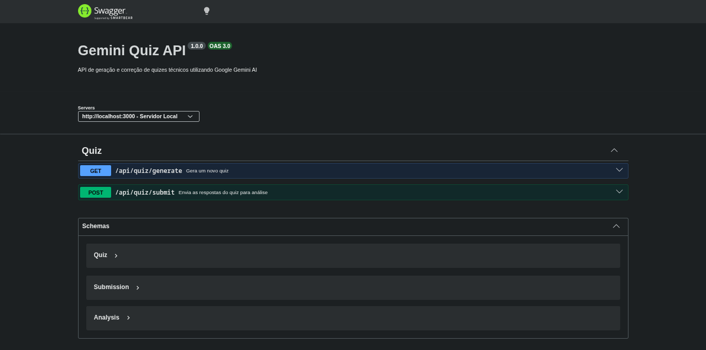

# Gemini Quiz API

Uma API para geração e correção automatizada de quizzes voltados para desenvolvedores, utilizando IA para criar perguntas dinâmicas, avaliar respostas e retornar feeback.



## Tecnologias Utilizadas

- **Ecossistema:** Node.js (ESM), TypeScript, Express
- **Inteligência Artificial:** Google Generative AI (Gemini Flash)
- **Validação & Tipagem:** Zod
- **Documentação:** Swagger
- **Performance:** Node-cache (armazenamento em memória das sessões)

---

## Como Executar o Projeto

### 1. Pré-requisitos

- Node.js (v18 ou superior)
- Chave de API do Gemini

  [(como gerar chave)](#gerar-da-api-key-do-gemini)

### 2. Instalação

Clone o repositório e instale as dependências:

```bash
git clone https://github.com/julia-ctp/gemini-quiz-api.git
cd gemini-quiz-api
npm install
```

### 3. Configuração de variáveis de ambiente

Crie um arquivo .env baseado no .env.example:

```bash
cp .env.example .env
```

Preencha as variáveis necessárias, incluindo sua API key do Gemini.

### 4. Rodando em Desenvolvimento

```bash
npm run dev
```

---

## Gerar API Key do Gemini

- Acesse o [Google AI Studio](https://aistudio.google.com/).
- Faça login com sua conta Google.
- Clique em "Get API key" no menu lateral.
- Clique em "Create API key in new project".
- Copie a chave gerada e guarde-a com segurança.

## Documentação da API

Após iniciar o servidor, acesse:

http://localhost:3000/docs

A interface Swagger permite testar todos os endpoints diretamente pelo navegador.
